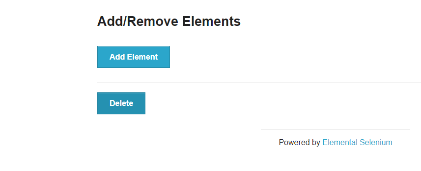

# webautomation
This is the repository where I am practicing testing with Playwright using TypeScript. I have used the site the-internet.herokuapp.com for practicing with interacting with elements.

## AddDeleteElements
This is a simple page where one can add and remove elements
